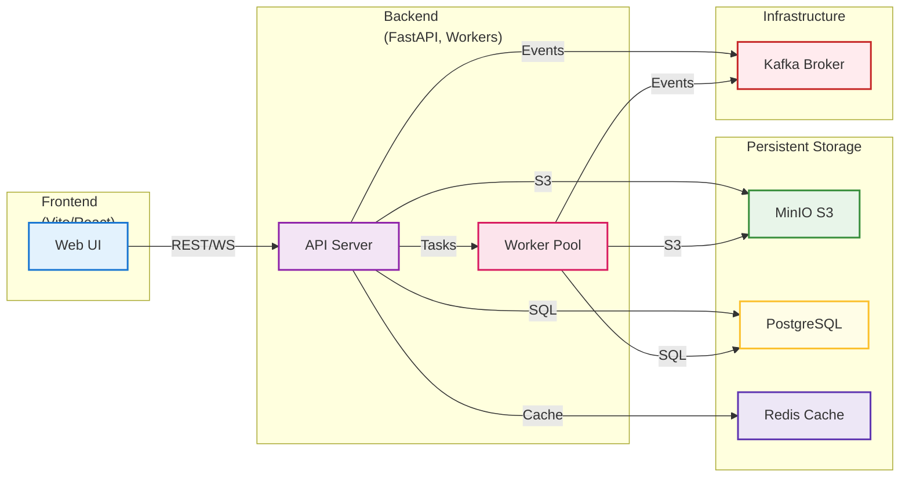
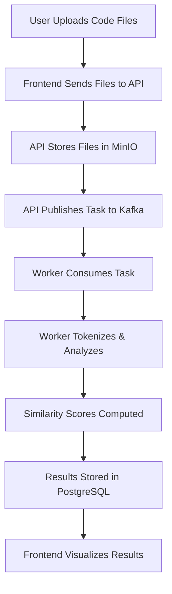

# PlagCode: Academic Code Similarity Detection Platform

PlagCode is a state-of-the-art, containerized platform for academic code similarity detection, designed for research, education, and scalable deployment. Leveraging advanced tokenization, distributed processing, and modern cloud-native architecture, PlagCode empowers educators and researchers to detect plagiarism and analyze code similarity across diverse programming languages with scientific rigor.

---


## 🧬 System Architecture



---

## 🧭 Workflow Overview



---

## 📦 Project Structure

```text
CodeMatch-Cloud-Deploy/
├── backend/         # FastAPI backend, workers, and business logic
│   ├── app/         # Core application modules
│   ├── db/          # Database migrations
│   └── uploads/     # Temporary file storage
├── frontend/        # Vite/React frontend
│   ├── src/         # UI components, screens, assets
│   └── public/      # Static files
├── samples/         # Example code files for testing
├── docker-compose.yml  # Multi-service orchestration
└── legacy_archive/  # Previous versions and research artifacts
```

---

## 🚀 Quick Start

### Prerequisites

- [Docker Desktop](https://www.docker.com/products/docker-desktop/) (Windows/Mac/Linux)

### Launch the Platform

```bash
docker-compose up -d --build
```

Access the web UI at [http://localhost:5173](http://localhost:5173)

### Service Endpoints

- **MinIO Console**: [http://localhost:9001](http://localhost:9001)
- **Postgres**: `localhost:5432` (see `.env` for credentials)

### Shutdown

```bash
docker-compose down
```

---

## 🧑‍💻 Usage Guide

1. **Upload**: Drag & drop or select at least two code files.
2. **Scan**: Initiate analysis via the "Start Scan" button.
3. **Review**: Explore similarity matrices, heatmaps, and detailed code comparisons.
4. **Export**: Download reports for further academic review.

---

## 🧪 Research & Extensibility

- **Algorithmic Core**: Modular design for integrating new similarity metrics (e.g., AST, semantic, ML-based).
- **Scalability**: Kafka-based distributed workers for large-scale or real-time analysis.
- **Reproducibility**: Deterministic tokenization and result storage for academic rigor.
- **Extensible Storage**: Pluggable backends (MinIO, S3, GCS, etc.).

---

## 🛠️ Development

- **Frontend**: Node.js 20+, Vite, React, Tailwind CSS (`frontend/`)
- **Backend**: Python 3.9+, FastAPI, SQLAlchemy, Celery (`backend/`)
- **Network**: All services communicate via the `plagcode-net` Docker network

---

## 📚 Academic References

- [Jaccard Index](https://en.wikipedia.org/wiki/Jaccard_index) for token-based similarity
- [Docker](https://www.docker.com/), [FastAPI](https://fastapi.tiangolo.com/), [React](https://react.dev/)

---

## 🏛️ License & Citation

This project is released under the MIT License. For academic use, please cite as:

> Ouaamar, H., et al. "PlagCode: A Cloud-Native Platform for Academic Code Similarity Detection." 2025.

---

## 🤝 Acknowledgements

Special thanks to the open-source community and contributors.

